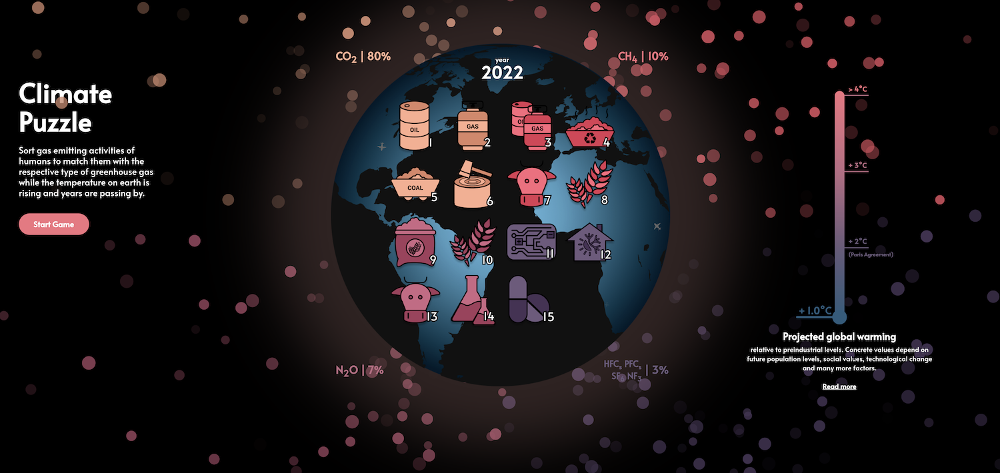

# Climate Puzzle

Climate Puzzle - [Flutter Puzzle Hack](https://flutterhack.devpost.com/) submission by Leon Steinmann

Check out [climate-puzzle.com](https://climate-puzzle.com/#/)

## Concept

A slide puzzle with the goal of sorting gas emitting activities of humans to match them with the respective type of greenhouse gas while the temperature on earth is rising and years are passing by. 

While solving the puzzle, better understand the origins of greenhouse gases ...and maybe even reflect on your role in this. 

## Behind the idea

From the first time I heard about the Flutter Puzzle Hack, I knew I wanted to dedicate the project to address the human caused climate change. After some brainstorming, I decided to extend the basic concept of a slide puzzle by telling a story - adding educational elements rather than simply extending game complexity. My goal was not to create an addictive game you play repeatedly but rather play it a few times and get something out of it. I wanted to create an atmosphere by utilizing animations and graphics to transport the message while the player is solving the puzzle. The message I thought about while developing the puzzle: 

> *To effectively address climate change, it is important to understand which actions have an actual impact on climate change.*

So instead of a "solution" puzzle with tiles of solar panels and electric cars, the puzzle takes a step back and focuses on the "problem" part of climate change: What human-based actions are causing climate change in the first place? 

After finalizing the concept, the first step was to create an atmosphere that sets the mood for the game. I quickly came up with the idea to use the planet as a background of the puzzle board and to create flying particles as a symbol for the constantly happening emissions. For the image of the earth, I used an open licensed SVG from Wikipedia created a negative and used a radial color gradient to create a sun reflection effect in Figma. Additionally, I animated a pulsating atmosphere for a glow effect to better display the presence of atmosphere around planet earth. 
Later on I added small animated airplanes flying around earth, which was more challenging as expected as I had to write a function to return the angle for each airplane based on the start and end positions to rotate the image accordingly. 
Creating the particles was the biggest challenge as I didn't have previous experience with Flutter's CustomPainter combined with AnimationBuilder. After reading some Medium articles I found the awesome work of Felix Blaschke's "stars" (link below) and used an adjusted approach for spawning the 500 CustomPainter particles behind earth. 
For the color scheme I started of with a red and blue tone highlighting temperature differences and created multiple matching colors (orange, rose, lila) using the color wheel. 

For the puzzle tiles I created the vector graphics for each of the sources of emissions of each gas using Figma. All categories are based on official reports of the EU commission on carbon dioxide, methane, nitrous oxide and fluorinated gases.

Finally, I wanted to integrate also the game timer into the theme of climate change. After trying out a few things I figured a temperature scale combined with the years passed would be most tangible for the player to get a feeling for the currently projected global warming by 2100. I created a thermometer using only Flutter Widgets with LinearGradient and animated the position and color of the player's indicator in the Stack Widget. 

To create a responsive layout I mainly used the Responsive Widgets from Very Good Ventures and aligned the elements accordingly, e.g. next to the vertical thermometer i created a horizontal version showing above the puzzle board on mobile.

## Highlights

- Gas particles - randomly generated with different color, opacity, size, speed, direction values
- Atmosphere - pulsating animation to show steady emission output
- Puzzle tiles - self-designed graphics to represent greenhouse gas emitting activities
- Thermometer - steadily increasing temperature while playing to show predicted climate change until year 2100
- Airplanes - discreet animation to create a more vividly earth (extending concept in future versions)

## Preview

Check out https://youtu.be/a9s3CXgvwk4 for the puzzle in action

## Inspiration

### Design
- [Flutter Dashatar Puzzle Challange](https://flutter.github.io/samples/slide_puzzle.html) - code base as starting point for puzzle functionality
- [Flutter Plasma by Felix Blaschke](https://flutterplasma.dev/) - "stars" inspiration for gas particles and overall animation creation

### Climate change data

- [climate.gov](https://www.climate.gov/news-features/understanding-climate/climate-change-global-temperature) 
- [EPA](https://www.epa.gov/ghgemissions/overview-greenhouse-gases)
- [European Commision](https://ec.europa.eu/clima/eu-action/fluorinated-greenhouse-gases_en)

## License

MIT License

Copyright (2022) Leon Steinmann leonsteinmann@gmail.com

Permission is hereby granted, free of charge, to any person obtaining a copy of this software and associated documentation files (the  "Software"), to deal in the Software without restriction, including  without limitation the rights to use, copy, modify, merge, publish,  distribute, sublicense, and/or sell copies of the Software, and to  permit persons to whom the Software is furnished to do so, subject to  the following conditions:

The above copyright notice and this permission notice shall be included in all copies or substantial portions of the Software.

THE SOFTWARE IS PROVIDED "AS IS", WITHOUT WARRANTY OF ANY KIND,  EXPRESS OR IMPLIED, INCLUDING BUT NOT LIMITED TO THE WARRANTIES OF  MERCHANTABILITY, FITNESS FOR A PARTICULAR PURPOSE AND NONINFRINGEMENT.  IN NO EVENT SHALL THE AUTHORS OR COPYRIGHT HOLDERS BE LIABLE FOR ANY  CLAIM, DAMAGES OR OTHER LIABILITY, WHETHER IN AN ACTION OF CONTRACT,  TORT OR OTHERWISE, ARISING FROM, OUT OF OR IN CONNECTION WITH THE  SOFTWARE OR THE USE OR OTHER DEALINGS IN THE SOFTWARE.

[license_badge]: https://img.shields.io/badge/license-MIT-blue.svg
[license_link]: https://opensource.org/licenses/MIT